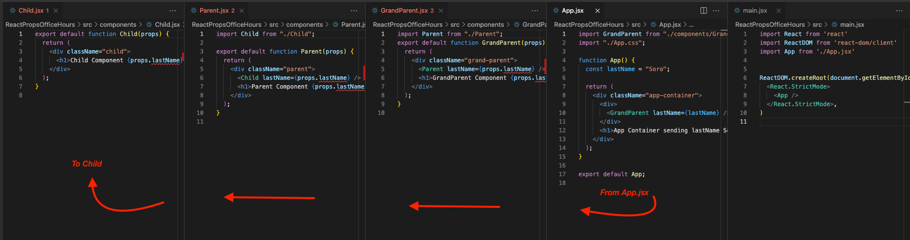
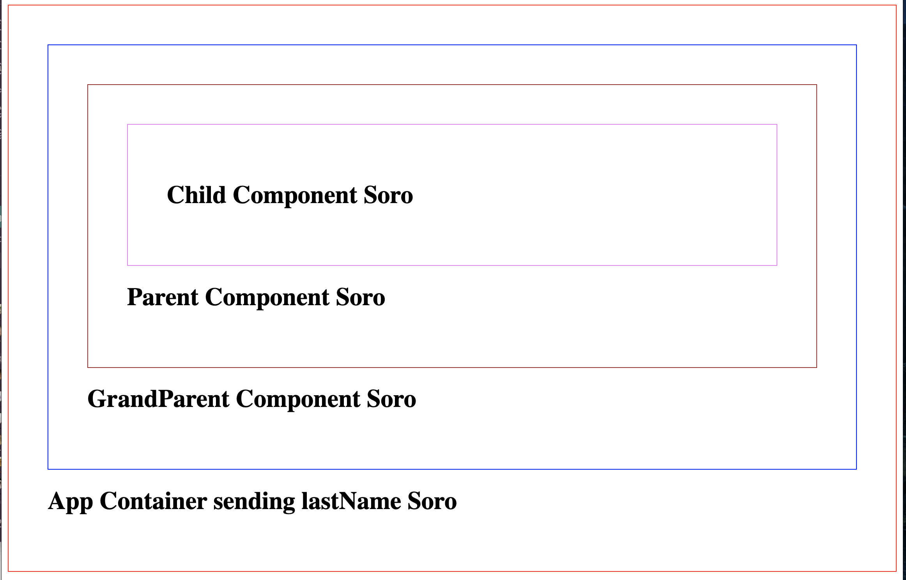

# React Props

Demonstration of React Props





```jsx
import GrandParent from "./components/GrandParent";
import "./App.css";

function App() {
  const lastName = "Soro";

  return (
    <div className="app-container">
      <div>
        <GrandParent lastName={lastName} />
      </div>
      <h1>App Container sending lastName Soro</h1>
    </div>
  );
}

export default App;
```

```jsx
import Parent from "./Parent";
export default function GrandParent(props) {
  return (
    <div className="grand-parent">
      <Parent lastName={props.lastName} />
      <h1>GrandParent Component {props.lastName}</h1>
    </div>
  );
}
```

```jsx
import Child from "./Child";

export default function Parent(props) {
  return (
    <div className="parent">
      <Child lastName={props.lastName} />
      <h1>Parent Component {props.lastName}</h1>
    </div>
  );
}
```

```jsx
export default function Child(props) {
  return (
    <div className="child">
      <h1>Child Component {props.lastName}</h1>
    </div>
  );
}
```
